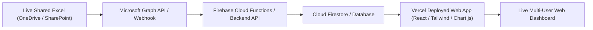

# Facility Multi-Tracker Live Web Analytics Hub

## 🌟 Executive Overview
This application is a **Real-Time, Multi-Tracker Operations Portal** built for facility tracking across multiple live shared Excel files (Equipment Breakdowns, Key & Locker Asset Audits, and any future Excel trackers you add).

---

## ⚡ Key Highlights & Capabilities

### 1. 🔒 100% Safe For Live Shared Files (Zero File Locking)
* **The Problem**: When multiple users are editing an Excel file via OneDrive or Excel desktop, standard software locks the file, throwing *"File in Use / Locked by another user"* errors.
* **Our Solution**: The backend engine utilizes **in-memory binary streaming** (`io.BytesIO`). It reads file bytes and releases the file handle in **under 2 milliseconds**. 
* **Guarantee**: Other users can keep the Excel files open and edit them in Excel/OneDrive at any time without any lock conflicts or disruptions.

---

### 2. 🔄 Automatic Real-Time Sync
* The web app runs a continuous **lightweight heartbeat** every 4 seconds checking file modification timestamps and MD5 hashes.
* When you or any teammate adds a row or updates a cell in Excel (locally or via OneDrive sync), the web app **instantly detects the change and refreshes the KPI cards, interactive charts, and data tables automatically** without reloading the page.
* Includes a manual **"Sync Now"** button with a live sync timestamp indicator.

---

### 3. 📂 Multi-Section Architecture in a Single Web App

| Section | Active Trackers & Sheets | Key Features |
| :--- | :--- | :--- |
| **📊 All Trackers Dashboard** | Cross-tracker consolidated command center | Consolidated KPI metrics cards, Master Search Box for all trackers, Master Status & Data Hub table with 1-click jumps & Excel downloads, Domain summary tables. |
| **🛠️ Breakdown Tracker** | `Breakdown Tracker.xlsx`<br>• *2026 Live Incidents*<br>• *2024-2025 Archive* | Total incidents (235), Resolution rate (95.7%), Open/WIP queue, Lead time (Hrs), Full vs Partial breakdown impact, Handled By distribution, Master Search, Sortable table & Row modal. |
| **🔐 Keys & Lockers Tracker** | `Keys Lock Tracker - 2026 1.xlsx`<br>• *Master Key Tracker*<br>• *Action & Audit List* | 244 lock units, 527 keys total, Issued vs Spare in BMS vs Missing keys alert, Zone breakdown (Zones A-F), Priority Action & Audit list, Master Search & Custodian filters. |
| **📅 Events Tracker (DT-3 & 4)** | `Yearly Event Tracker- DT-3 and DT-4 Updated.xlsx`<br>• *Master Event Tracker 2026* | 1,857 full-year event records across Downtown-3 and Downtown-4, booking confirmation statuses, Pax capacity, timing, Master Search, Building & Month filters. |
| **🍽️ F&B Operations Tracker** | `Event_Tracker_Pro_Executive_Dashboard.xlsx`<br>• *Master Event Tracker* | 63 corporate events, ₹2.48M spend, 14,280 pax, effective cost/pax, primary vendor breakdown (Pihu/In-House), payment mode, Master Search & table filters. |
| **👥 Contractual Staff (VAS)** | `Contractual Staff Details_Updated.xlsx`<br>• *Contractual Staff Details* | 449 total staff members, 229 active on-site, 94.2% BGV compliant, agency breakdown, designation, contact numbers, Master Search & location filters. |
| **➕ Auto-Scanned Trackers** | Dynamic discovery of any future `.xlsx` files | Automatically scans folders (e.g. `HVAC/`, `Housekeeping/`, `Inventory/`) and creates new navigation tabs dynamically. |

---

### 4. 📥 1-Click Excel & CSV Downloads from Every Section
* **Download Live Excel**: Each section has a dedicated **"Download Excel"** button that serves the exact live `.xlsx` file.
* **Export Filtered View (CSV)**: Export whatever filtered, searched, or sorted view you are currently analyzing directly into a clean `.csv` file.

---

## 🚀 How to Run the Web Application

### Option A: 1-Click Launch (Recommended)
Double-click [`start_dashboard.bat`](file:///C:/Users/SMohanty6/OneDrive%20-%20CBRE,%20Inc/Desktop/Trackers/start_dashboard.bat) in the root folder.
* Starts the Python live sync server.
* Automatically opens your default web browser to **`http://localhost:8080`**.

### Option B: Terminal / Command Prompt
```powershell
python server.py
```
Open your browser and navigate to:
```
http://localhost:8080
```

### Option C: Direct HTML Preview
You can also open [`index.html`](file:///C:/Users/SMohanty6/OneDrive%20-%20CBRE,%20Inc/Desktop/Trackers/index.html) directly in any modern browser for immediate visual layout testing.

---

## 📁 How to Add More Excel Trackers in the Future
1. Create a new subfolder in your workspace (e.g., `HVAC/`, `Pantry/`, `Housekeeping/`).
2. Place your `.xlsx` tracker file inside that folder.
3. The engine will **automatically detect the new file**, parse its worksheet headers, calculate summary stats, and render a new section tab in the web application!

---

## ☁️ Cloud Deployment Roadmap (GitHub, Vercel & Firebase)

When you are ready to transition from local hosting to full 24/7 cloud hosting:



### Step 1: GitHub Repository Setup
* Initialize a Git repository:
  ```bash
  git init
  git add index.html server.py tracker_engine.py start_dashboard.bat
  git commit -m "Initial commit: Facility Multi-Tracker Web App"
  ```
* Push to a private GitHub repository (`cb-facility-trackers`).

### Step 2: Deploy Frontend on Vercel
* Connect your GitHub repo to **Vercel** (`https://vercel.com`).
* Vercel will provide a secure HTTPS public URL (e.g. `https://facility-trackers.vercel.app`) with automatic continuous deployment on every git push.

### Step 3: Connect Cloud Firebase / Microsoft Graph API for Direct OneDrive Cloud Sync
* For direct cloud-to-cloud synchronization without needing a local computer running:
  1. Register an Azure App in Microsoft Entra ID for **Microsoft Graph API**.
  2. Subscribe to OneDrive / SharePoint Webhook notifications for Excel file updates.
  3. Deploy a lightweight **Firebase Cloud Function** (or FastAPI on Render/Railway) that parses Excel sheets on webhook trigger and stores structured documents into **Firebase Firestore**.
  4. The Vercel frontend subscribes to Firestore real-time snapshots (`onSnapshot`) for instant global sync across all users worldwide.
